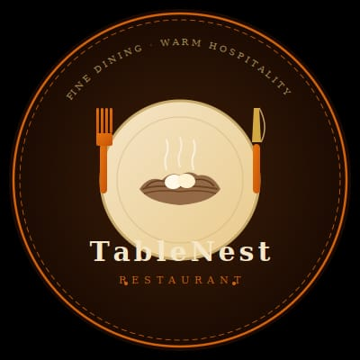
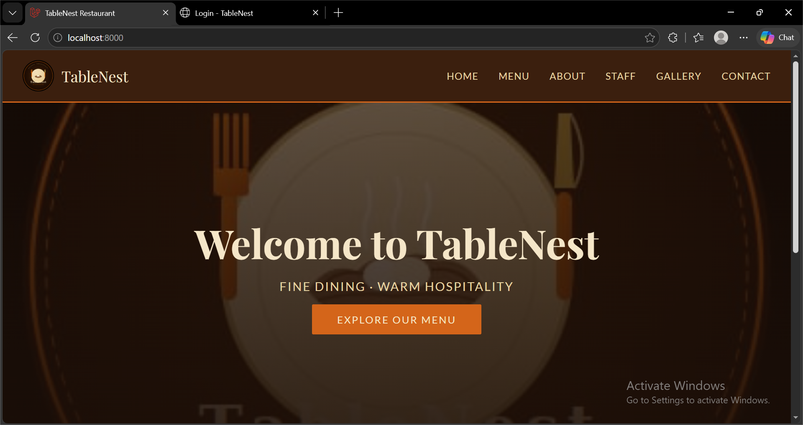
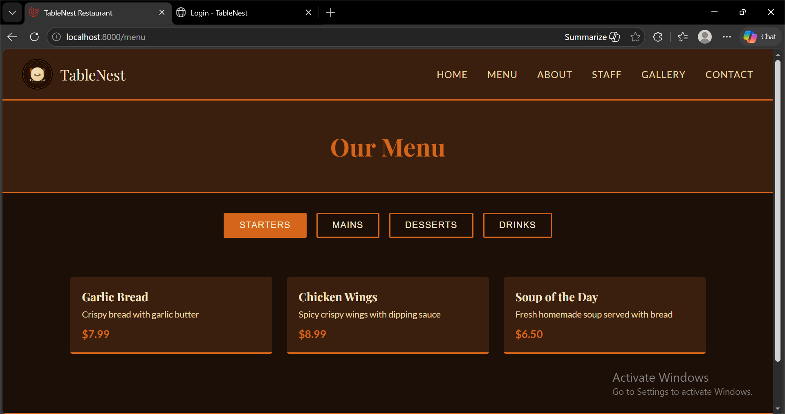
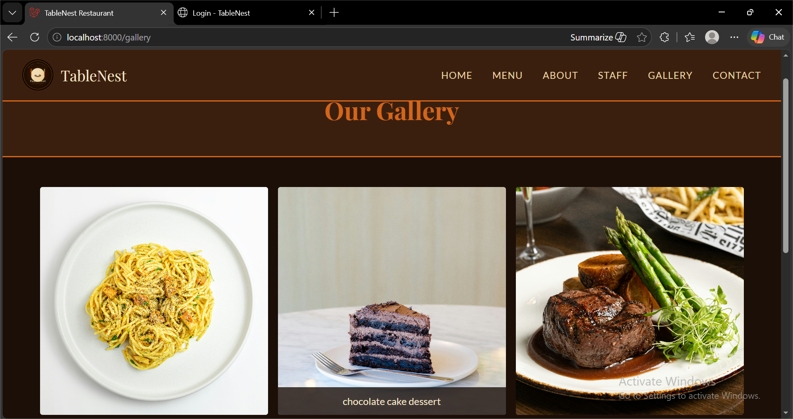
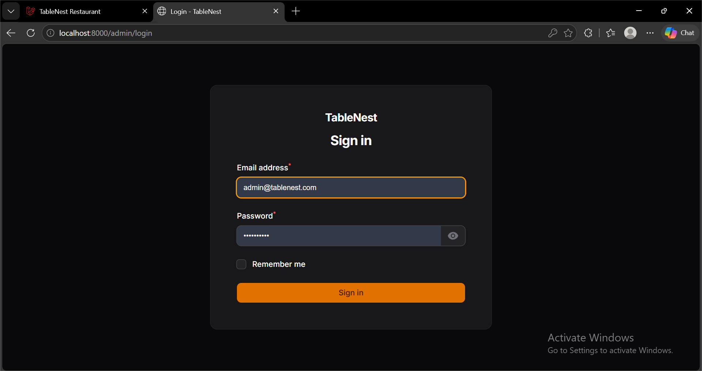
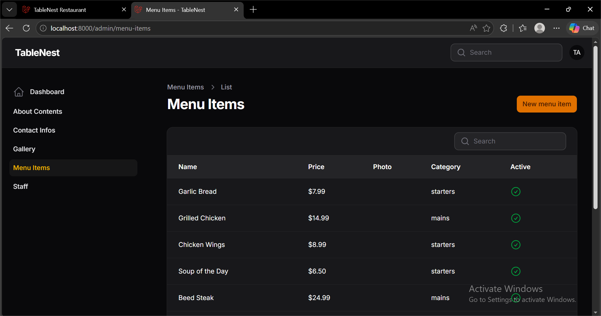

<div align="center">



# TableNest Restaurant

### Fine Dining · Warm Hospitality

A fully functional, production-ready restaurant website with a custom admin panel — built with Laravel 12 & Filament v5.

[](https://laravel.com)
[](https://filamentphp.com)
[](https://php.net)
[](https://mysql.com)

</div>

---

## Overview

TableNest is a complete restaurant web presence — from a polished public-facing site to a fully secured admin dashboard. The restaurant owner can independently manage every piece of content: menu items, staff profiles, gallery photos, contact details, and the About page — all without touching a single line of code.

---

## Screenshots

### Public Website




### Admin Panel



## Pages

| Route | Page | Description |
|-------|------|-------------|
| `/` | Home | Hero banner, tagline, and call-to-action |
| `/menu` | Menu | Tabbed by category: Starters, Mains, Desserts, Drinks |
| `/about` | About Us | Restaurant story, chef profile, brand values |
| `/staff` | Our Team | Staff cards with photos, names, and roles |
| `/gallery` | Gallery | Masonry photo grid with hover captions |
| `/contact` | Contact | Address, phone, email, map embed, contact form |
| `/admin` | Admin Panel | Secure dashboard — full content control |

---

## Admin Panel

> Powered by [Filament v5](https://filamentphp.com) — a world-class Laravel admin framework.

The **TableNest Admin** can log in at `/admin` and manage:

- 🍽️ **Menu Items** — name, description, price, category, photo, active/inactive toggle
- 👨‍🍳 **Staff** — name, role, photo, display order
- 🖼️ **Gallery** — upload or delete photos with captions
- 📖 **About Content** — story, chef name, chef bio, chef photo, values
- 📍 **Contact Info** — address, phone, email, Google Maps embed

---

## Tech Stack

```
Frontend    →  Blade Templates · Vanilla CSS · Alpine.js
Backend     →  Laravel 12 (PHP 8.2)
Database    →  MySQL 8
Admin       →  Filament v5
Auth        →  Laravel Breeze
Storage     →  Laravel Filesystem (local/public disk)
Build Tool  →  Vite
```

---

## Local Setup

### Prerequisites

- PHP 8.2+
- Composer
- Node.js 18+ & npm
- MySQL
- XAMPP or Laravel Herd

---

### Step 1 — Clone

```bash
git clone https://github.com/AreebaGhaffar/tablenest.git
cd tablenest
```

### Step 2 — Install Dependencies

```bash
composer install
npm install && npm run build
```

### Step 3 — Environment

```bash
cp .env.example .env
php artisan key:generate
```

Update `.env`:

```env
APP_NAME=TableNest
APP_URL=http://localhost:8000

DB_CONNECTION=mysql
DB_HOST=127.0.0.1
DB_PORT=3306
DB_DATABASE=tablenest
DB_USERNAME=root
DB_PASSWORD=

FILESYSTEM_DISK=public
FILAMENT_FILESYSTEM_DISK=public
```

### Step 4 — Database

Create a MySQL database named `tablenest`, then run:

```bash
php artisan migrate
php artisan storage:link
```

### Step 5 — Admin Account

```bash
php artisan make:filament-user
```

| Field | Value |
|-------|-------|
| Name | TableNest Admin |
| Email | admin@tablenest.com |
| Password | *(set your own)* |

### Step 6 — Serve

```bash
php artisan serve
```

Visit → `http://localhost:8000`  
Admin → `http://localhost:8000/admin`

---

## Project Structure

```
tablenest/
├── app/
│   ├── Filament/
│   │   └── Resources/           # Admin CRUD resources
│   │       ├── AboutContents/
│   │       ├── ContactInfos/
│   │       ├── Galleries/
│   │       ├── MenuItems/
│   │       └── Staff/
│   ├── Http/Controllers/        # Public page controllers
│   └── Models/                  # Eloquent models
├── database/
│   └── migrations/              # All table migrations
├── resources/
│   └── views/
│       ├── layouts/
│       │   └── app.blade.php    # Shared navbar + footer
│       ├── home.blade.php
│       ├── menu.blade.php
│       ├── about.blade.php
│       ├── staff.blade.php
│       ├── gallery.blade.php
│       └── contact.blade.php
├── routes/
│   └── web.php
└── public/
    └── images/
        └── logo.jpeg
```

---

## Deliverables Checklist

- [x] Fully functional restaurant website — all 6 pages
- [x] Secure admin login — TableNest Admin only
- [x] Mobile responsive — phones, tablets, desktops
- [x] Working demo with sample content
- [x] Complete, clean, well-organized source code
- [x] 1 round of revisions included after delivery

---

## Design

The visual identity is derived directly from the TableNest logo:

| Token | Value | Usage |
|-------|-------|-------|
| `--dark` | `#1C0F08` | Page background |
| `--brown` | `#3B1F0E` | Cards, navbar |
| `--cream` | `#F5E6C8` | Primary text |
| `--orange` | `#D4651A` | Accents, CTAs |
| `--tan` | `#E8D5A3` | Secondary text |

Typography: **Playfair Display** (headings) · **Lato** (body)

---

## License

This project was built as a client deliverable. All rights reserved.

---

<div align="center">

Built with Laravel & Filament · Delivered by **Areeba Ghaffar**

</div>
